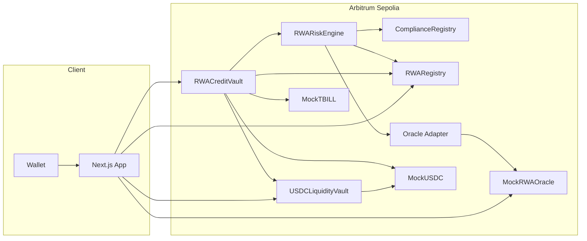
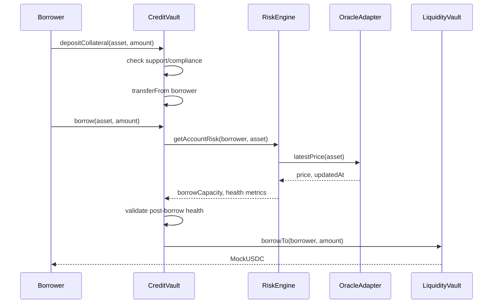
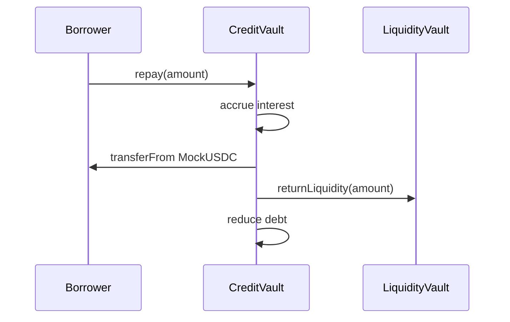
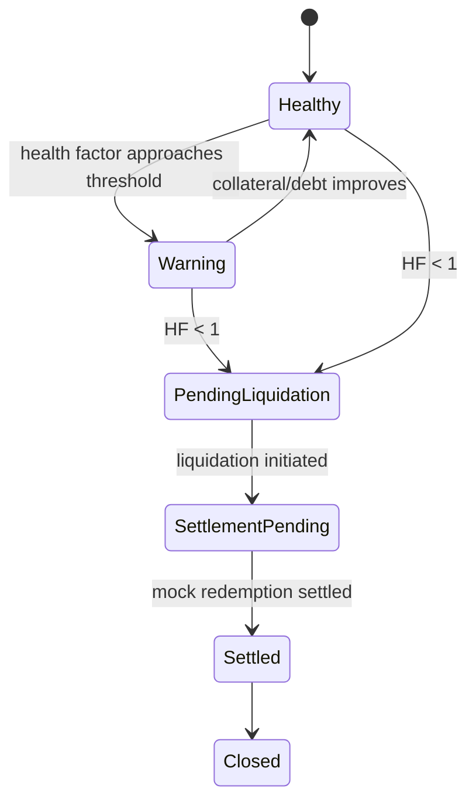
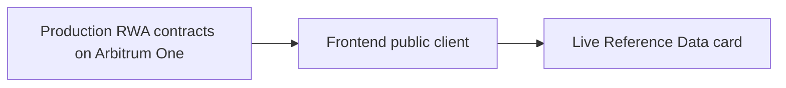

# System Architecture

## 1. Overview

YieldLine consists of four logical layers:

1. asset and compliance adapters
2. risk calculation
3. credit and liquidity accounting
4. frontend/read layer

## 2. Trust boundaries

### Onchain trusted configuration

For the workshop, an administrator controls:

- supported-asset registration
- risk parameters
- mock compliance status
- mock oracle updates
- pause controls
- liquidation settlement

This centralization is intentional for MVP speed and must be displayed in the docs/UI.

### Oracle boundary

The credit system trusts an oracle adapter to provide:

- price
- timestamp
- validity

A non-zero price is not sufficient; timestamp freshness must also be checked.

### Compliance boundary

The protocol trusts the compliance adapter to determine whether an address is eligible for a particular asset.

The workshop adapter is a simple mapping. A production adapter may query an issuer-owned registry.

### External asset boundary

YieldLine cannot assume a production permissioned token is transferable to its vault. Production integration requires issuer-specific eligibility and transfer compatibility.

## 3. Main borrow sequence

## 4. Repay sequence

An implementation may have the vault pull USDC directly into the liquidity vault. Choose one canonical flow and test it.

## 5. Deferred liquidation sequence

MVP implementation may collapse `PendingLiquidation` and `SettlementPending` into one state.

## 6. Read-only production reference path

The frontend may show current information from a production RWA contract or official oracle using an RPC read.

Important:

- no production transactions are required
- production data must be visually labeled as reference data
- the workshop position uses testnet mock assets

## 7. Upgrade strategy

MVP recommendation:

- deploy non-upgradeable contracts
- redeploy when changing implementation
- keep configuration mutable only where necessary

Reason:

Upgrade proxies add storage-layout and admin risk that are unnecessary for a workshop prototype.

## 8. Optional backend

Do not introduce a backend unless needed.

The MVP can read:

- positions from contracts
- events from RPC
- market state from public clients

An indexer becomes useful for:

- transaction history
- aggregate analytics
- many users/assets
- historical risk charts

See `12_EVENTS_AND_INDEXING.md`.

## 9. Arbitrum-specific extension

Post-MVP, `RWARiskEngine` can be moved to a Rust Stylus contract while retaining Solidity vaults. Keep the initial ABI clean so the engine is replaceable through an interface.
