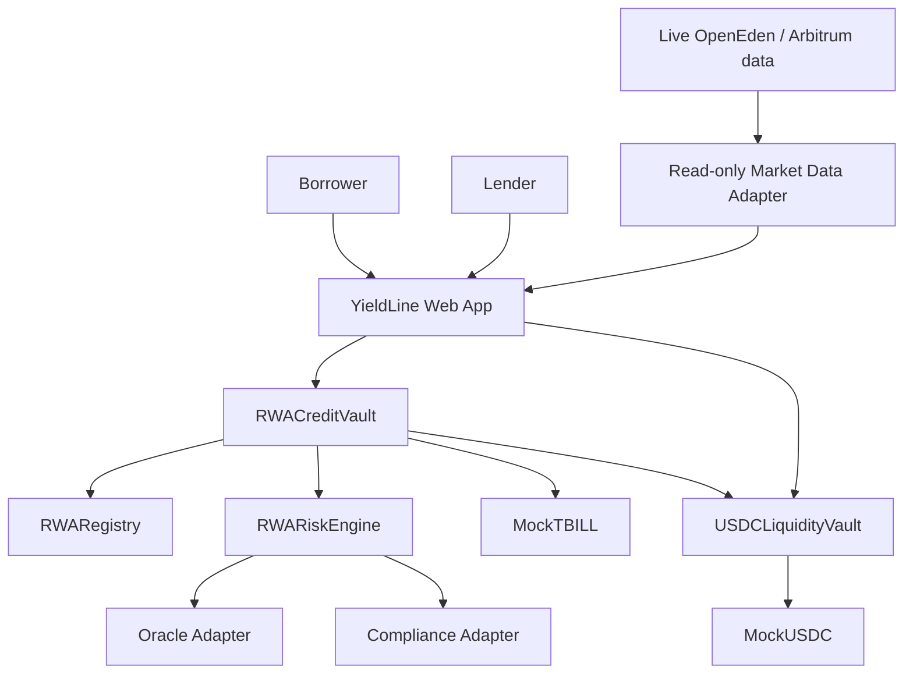

# YieldLine

> RWA-native credit infrastructure for Arbitrum.

YieldLine is a lending and risk-abstraction protocol designed for tokenized real-world assets (RWAs). The MVP demonstrates how a permissioned, NAV-priced asset such as a tokenized Treasury instrument can be used as collateral for USDC-like liquidity without pretending that RWAs behave like ordinary crypto collateral.

## Core thesis

Putting an asset onchain does not automatically make it safe DeFi collateral.

RWA collateral can introduce:

- NAV-based rather than continuously traded pricing
- delayed or asynchronous redemption
- transfer allowlists and KYC/KYB requirements
- limited secondary-market liquidity
- issuer, custodian, and settlement risk
- stale-price risk
- business-day settlement constraints

YieldLine models those properties explicitly.

## MVP

The workshop MVP runs on **Arbitrum Sepolia** and contains:

1. `MockTBILL` — permissioned mock RWA
2. `MockUSDC` — test settlement asset
3. `ComplianceRegistry` — demo wallet allowlist
4. `RWARegistry` — per-asset collateral configuration
5. `MockRWAOracle` + oracle adapter — NAV and timestamp
6. `RWARiskEngine` — effective LTV and health-factor calculations
7. `RWACreditVault` — deposit, borrow, repay, withdraw
8. `USDCLiquidityVault` — ERC-4626 lender pool
9. deferred-liquidation state machine
10. web dashboard for borrower, lender, market, and risk simulation flows

Production OpenEden TBILL contracts are treated as **read-only reference integrations** in the workshop build. The MVP does not claim that the YieldLine vault is approved to custody production TBILL.

## Target architecture



## Repository target

```text
yieldline/
├── contracts/
│   ├── src/
│   ├── test/
│   └── script/
├── frontend/
├── packages/
│   └── shared/
├── docs/
└── README.md
```

## Documentation map

| File | Purpose |
|---|---|
| `01_PRODUCT_REQUIREMENTS.md` | Product goals, users, functional requirements |
| `02_SYSTEM_ARCHITECTURE.md` | Components, trust boundaries, flows |
| `03_SMART_CONTRACTS.md` | Contract responsibilities and storage |
| `04_CONTRACT_INTERFACES.md` | Suggested Solidity interfaces and APIs |
| `05_RWA_REGISTRY.md` | Collateral configuration model |
| `06_RISK_ENGINE.md` | LTV, haircuts, health factor, risk logic |
| `07_ORACLE_DESIGN.md` | NAV oracle and staleness handling |
| `08_COMPLIANCE_DESIGN.md` | Permissioned-token integration model |
| `09_LIQUIDATION_SETTLEMENT.md` | Deferred liquidation and settlement |
| `10_LIQUIDITY_VAULT.md` | Lender ERC-4626 pool and interest model |
| `11_FRONTEND_SPEC.md` | Pages, components, and UX states |
| `12_EVENTS_AND_INDEXING.md` | Events, optional indexer, read model |
| `13_TESTING_STRATEGY.md` | Unit, invariant, integration, and UI tests |
| `14_SECURITY_THREAT_MODEL.md` | Threats, controls, MVP limitations |
| `15_DEPLOYMENT_ARBITRUM.md` | Arbitrum Sepolia deployment |
| `16_DEVELOPER_SETUP.md` | Local environment and development workflow |
| `17_MVP_ROADMAP.md` | Build order and milestones |
| `18_DEMO_SCRIPT.md` | Workshop live-demo sequence |
| `19_PITCH.md` | Short and long project pitch |
| `20_DECISIONS_AND_ASSUMPTIONS.md` | Explicit architecture decisions |
| `21_BACKLOG.md` | Post-MVP extensions |
| `22_REFERENCES.md` | Primary documentation links |

## Getting started

Prerequisites: Node.js 20+, pnpm, [Foundry](https://getfoundry.sh).

```bash
pnpm install
pnpm test                 # 92 Foundry tests: unit, fuzz, scenarios, invariants
pnpm abis                 # regenerate packages/shared ABIs from the Foundry build
```

### Local demo (Anvil)

```bash
pnpm anvil                                            # terminal 1
DEPLOYER_PRIVATE_KEY=<anvil key #0> pnpm deploy:anvil # terminal 2, writes deployments/anvil.json
echo NEXT_PUBLIC_YIELDLINE_NETWORK=anvil > frontend/.env.local
pnpm dev
```

Import the Anvil deployer key into your wallet: it holds every admin role, so the
admin simulator can move the oracle, allowlist wallets, mint test tokens, and settle
liquidations. `DEMO_LENDER` / `DEMO_BORROWER` env vars seed separate wallets.

### Arbitrum Sepolia

```bash
# .env: ARBITRUM_SEPOLIA_RPC_URL, DEPLOYER_PRIVATE_KEY, ARBISCAN_API_KEY
pnpm deploy:sepolia        # deploys, verifies, writes deployments/arbitrum-sepolia.json
pnpm build
```

Without a deployment the frontend runs on the documented demo scenario and labels it so.

### Implementation status

Build-order phases 1–9 are implemented and tested. Interest accrual is intentionally
not onchain yet (the Lend page shows the model APR as an estimate), and the
production-reference panel is still backlog. Testnet deployment (phase 10) needs a
funded deployer key.

## Definition of MVP success

The MVP is complete when a demo user can:

1. receive mock TBILL
2. become allowlisted
3. deposit TBILL as collateral
4. view NAV, effective LTV, and health factor
5. borrow mock USDC supplied by another user
6. accrue interest
7. repay and withdraw collateral
8. simulate a stale oracle and observe borrowing restrictions
9. simulate a NAV drop and move the position into liquidation
10. demonstrate deferred settlement rather than an instant DEX liquidation

## Non-goals for the workshop

- real-world KYC processing
- custody of production OpenEden TBILL
- production legal/compliance claims
- mainnet deployment
- DAO governance
- cross-chain borrowing
- production-grade credit underwriting
- permissionless onboarding of arbitrary RWAs

## Recommended stack

- Solidity
- Foundry
- OpenZeppelin Contracts
- Arbitrum Sepolia
- Next.js + TypeScript
- wagmi + viem
- WalletConnect / injected wallets
- Tailwind CSS or equivalent
- optional lightweight indexer after core contracts are finished

See the numbered documents before implementation.
